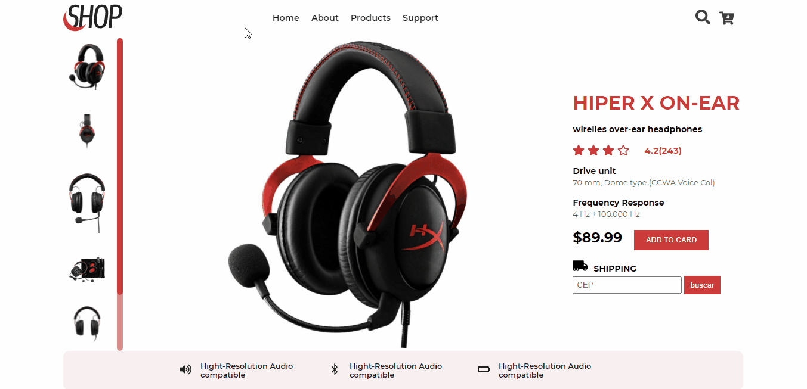
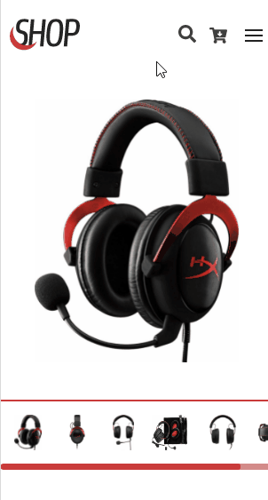
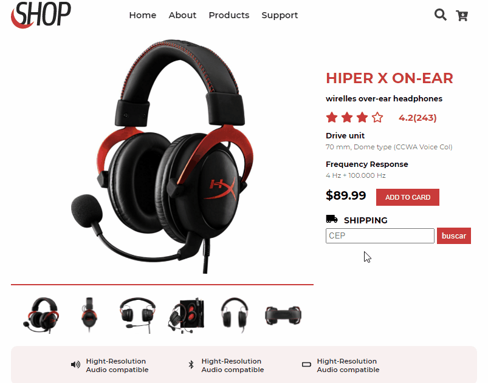

# Lading Page E-commerce Fone

    Landing Page E-Commerce para compra fone de ouvido

# Funcionalidades: 
- Simulador de frete usando Api externa
- Requisiçao do produto a um arquivo externo em formato json simulando um banco de dados 
- Menu mobile interativo
- Pagina responsiva
- Validaçao de diferentes modelos de cep por Regular Expression

## Versao Mobile:

## Requisiçao de Endereço:
<pre align="center">Usando api externa para busca endereço pelo cep
https://viacep.com.br/ws/00000000/json/
  
</pre> 

## Tecnologias:
- Html5
- Css3
- JavaScript
- ESLint
- webpack
- Regular Expression
- Api viacep https://viacep.com.br/ws/00000000/json/

## Style:
<pre>
    display: grid
    cores: #ca3b3a, #222 , #555 #fff
    font-family: 'Montserrat', sans-serif
    icones: Font Awesome
</pre>

## Link para Teste:
- https://devsergionunes.github.io/fone-product-Ecommerce/

## Consideraçoes:

Desafio criado por <a href="https://www.linkedin.com/in/emmanuel-messias-535621127/">Emmanuel Messias</a>,
 <a href="https://www.devchallenge.com.br/">DevChallenge</a>

 

## OBSERVAÇOES:
<pre>
    Em caso de teste do codigo, use uma servidor local para que requisiçoes funcionem corretamente.
    Live-server é um exemplo. 
</pre>
